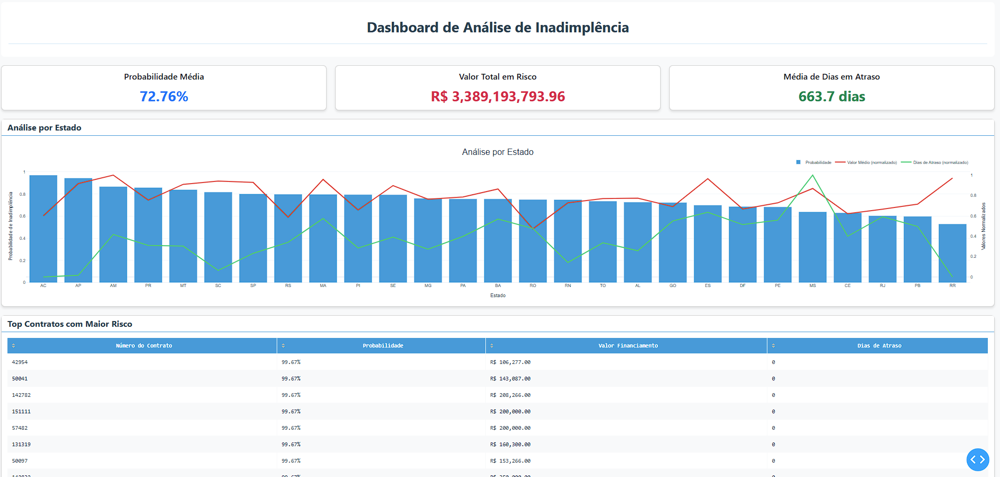

# 📊 Default Propensity Model with Analytical Dashboard

## 📝 About the Project

This project implements a Machine Learning model (Random Forest) to predict customer default propensity, complemented by an interactive dashboard for result analysis. The model was trained with historical data and uses various features to make accurate predictions about default probability.

## 🚀 Technologies Used

### Machine Learning Model
- **Python 3.7+**
- **Scikit-learn**: 
  - RandomForestClassifier
  - train_test_split
  - MinMaxScaler
  - Metrics (precision_score, recall_score, f1_score, accuracy_score, roc_auc_score)
- **Pandas**: Data manipulation and analysis
- **NumPy**: Numerical computing
- **Matplotlib**: Basic visualizations
- **Seaborn**: Statistical visualizations
- **Imbalanced-learn**: 
  - SMOTE for data balancing
  - Under/Over sampling
- **Joblib**: Model saving and loading
- **PyODBC**: SQL Server connection

### Dashboard and Visualization
- **Dash**: Framework for interactive dashboards
- **Plotly**: 
  - Express for quick graphs
  - Graph Objects for custom graphs
- **Dash Bootstrap Components**: Responsive UI components
- **Dash DataTable**: Interactive and sortable tables
- **Flask**: Base web server

### Data Processing and Analysis
- **Openpyxl**: Excel file reading
- **Pandas**: 
  - Data manipulation
  - Aggregations
  - Transformations
  - Exploratory analysis

### Development and Quality
- **Git**: Version control
- **Python warnings**: Warning handling
- **Try/Except**: Error handling

### Environment and Deployment
- **Flask**: Web server
- **Dash**: Development server
- **Port 8050**: Default server port

## 🛠️ Installation

1. Clone the repository:
```bash
git clone https://github.com/GabrielHenriqueCA/loan-default-prediction.git
cd default_prone_model/src
```

2. Create a virtual environment (recommended):
```bash
python -m venv venv
source venv/bin/activate  # Linux/Mac
venv\Scripts\activate     # Windows
```

3. Install dependencies:
```bash
pip install -r requirements.txt
```

## 🎯 Implemented Features

### 1. Default Propensity Model
- Random Forest training
- Important features:
  - Payment history
  - Financing amount
  - Customer age
  - Location
  - Other relevant factors
- Evaluation metrics:
  - Accuracy

### 2. Analytical Dashboard
#### Key Metrics
- Average default probability
- Total risk value
- Average days in delay

#### Visualizations
- State analysis bar chart with:
  - Default probability
  - Average financing value (normalized)
  - Average delay days (normalized)
- Risk distribution pie chart
- Regional heat map
- Time trend graph

#### Contracts Table
- List of top 10 highest risk contracts
- Sortable by any column
- Automatic monetary and percentage formatting

## 🎨 Customization

The dashboard uses a custom color palette that can be easily modified in the `app.py` file:

```python
COLORS = {
    'background': '#F8F9FA',
    'card': '#FFFFFF',
    'text': '#2C3E50',
    'primary': '#3498DB',
    'secondary': '#E74C3C',
    'tertiary': '#2ECC71',
    'highlight': '#F1C40F'
}
```

## 🚀 How to Run

1. Ensure the Excel file is in the correct directory
2. Run the server:
```bash
python app.py
```
3. Access the dashboard at: `http://localhost:8050`

## 📷 Dashboard Preview



## 🤝 Contribution

Contributions are welcome! To contribute:

1. Fork the project
2. Create a feature branch (`git checkout -b feature/AmazingFeature`)
3. Commit your changes (`git commit -m 'Add some AmazingFeature'`)
4. Push to the branch (`git push origin feature/AmazingFeature`)
5. Open a Pull Request

## 📝 License

This project is under the MIT license. See the `LICENSE` file for more details.

## 📧 Contact

For suggestions, questions, or contributions, contact through:
- Email: [gabrielhcacontato@gmail.com]
- LinkedIn: [https://www.linkedin.com/in/gabrielhenri/']
